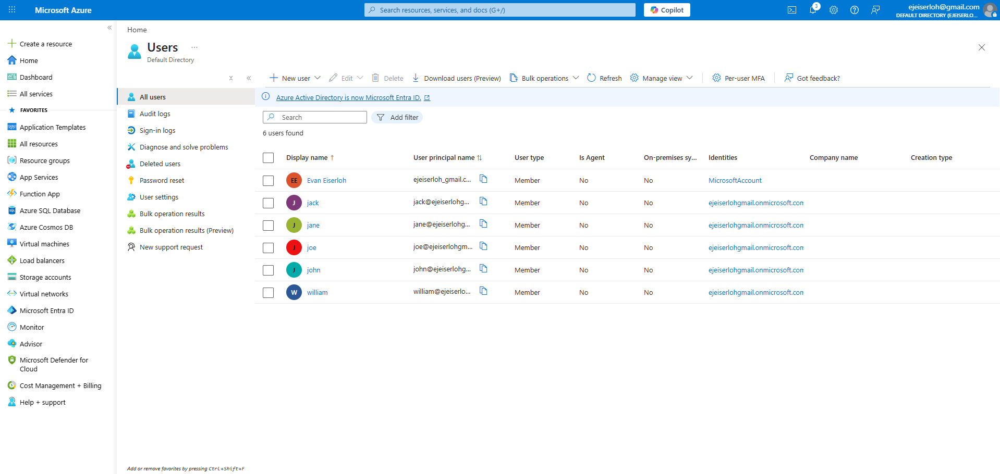
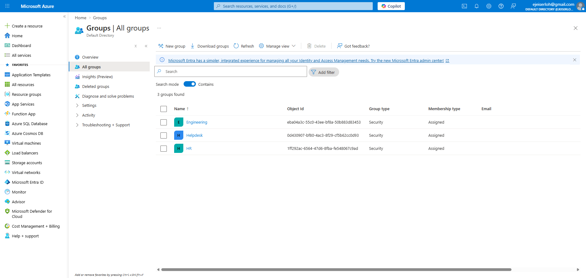
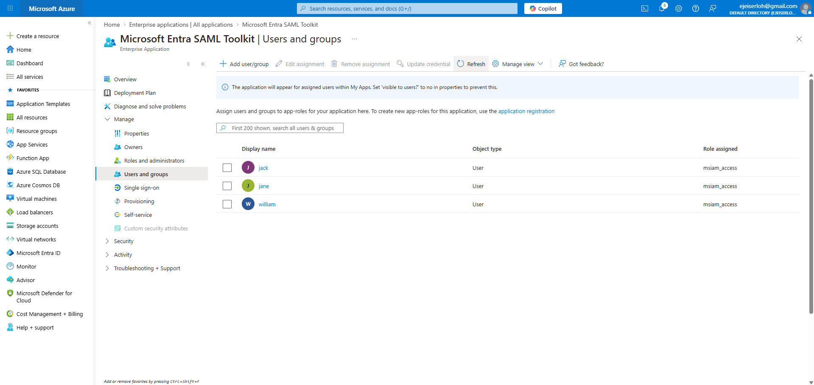
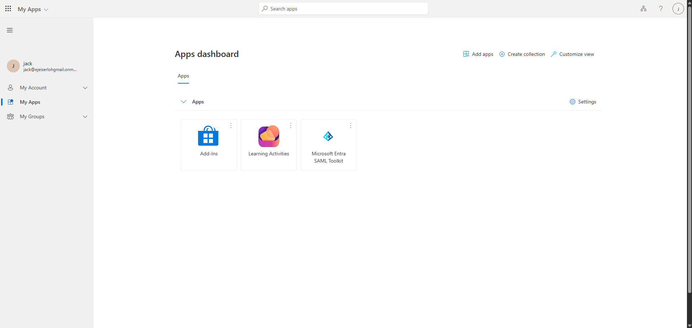
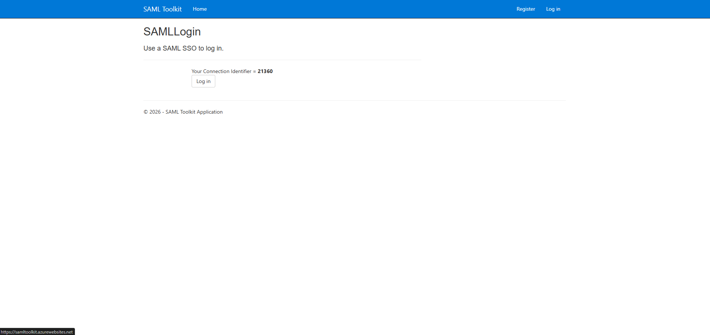
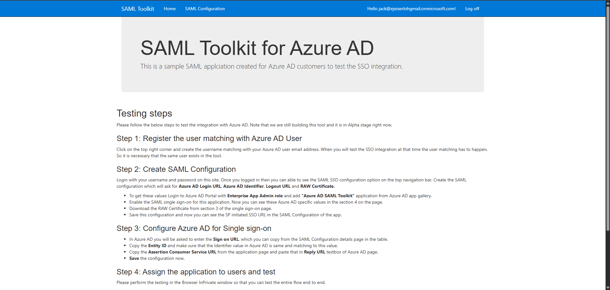

# Microsoft Entra ID IAM Lab

The lab demonstrates
*  Role-based access control (RBAC)
*  Single Sign-On (SSO) configuration
*  Multi-Factor Authentication (MFA)
*  Identity Governance (Access Reviews, Entitlements)
*  Authentication troubleshooting using audit logs

# Objectives 
*  Implement group-based access control
*  Configure secure authentication flows
*  Simulate real IAM support scenarios
*  Build job-ready IAM experience

# User setup

My account is the Global Admin and the rest are simulated employees

# Group Design

Model: User -> Group -> Resource

# Access Management
**Enterprise Application (SSO)**
*  Configured test application (SAML-based)
*  Group-based assignement
*  Engineering group -> App access
**Key Concept**
*  Eliminates direct user-to-app assignments
*  Improves scalability and auditability

